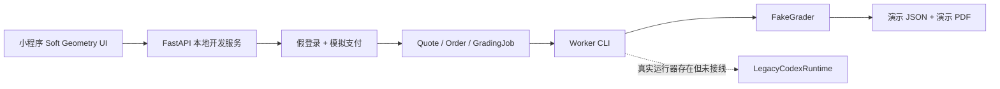
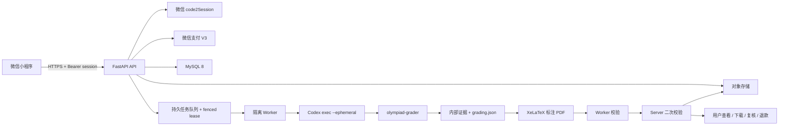

# 数学竞赛题批改：真实上线更新路线

> - 审计日期：2026-08-14
> - 代码基线：`03e3c0a fix(miniapp): refine post-payment task navigation`
> - 文档性质：只读审计与后续实施规范；本次不修改业务代码
> - 当前结论：小程序 UI 已达到可冻结基线，但仓库仍是本地演示链路，不可直接作为真实收费服务上线。

本次复核的测试现状：

- 小程序 Node：`126 passed / 0 failed`；
- Python：`754 passed / 34 failed / 6 skipped`；
- Python 失败主要集中在价格从测试预期的 `1000 cents/page` 漂移为本地 `.env` 的 `100 cents/page`，以及退款策略/网关测试与当前行为不一致；
- 因此当前不能把 CI 描述为“全绿”，Phase 0 必须先建立不受本地 `.env` 污染的确定性测试配置并清零这些失败。

## 0. 这份文档解决什么

这份文档统一三件事：

1. 冻结已经确认的 UI 风格与交互逻辑，后续任何后端、支付、登录或批改更新都不能破坏它。
2. 列出从演示版升级到真实上线版的阻断项、对应解决方案和可验证的完成标准。
3. 明确真实 Codex 批改、三种赛制、报告生成、用户隔离、支付和售后的最终工作流。

这里的“UI 与交互统一是首位”是产品约束，不代表可以降低安全或支付要求。真实上线必须同时满足：

- UI 风格不退化；
- 评分标准不串档；
- 用户数据不串户；
- 支付、退款和结果交付以服务端为准；
- Worker、Codex 与 PDF 生成环境可隔离、可取消、可审计；
- 所有 P0 上线阻断项清零。

---

## 1. 必须冻结的 UI 风格与交互规范

### 1.1 产品气质

已确认的视觉方向名称为 **Soft Geometry**。

关键词：

- 现代数学期刊；
- 克制、专业、可信；
- 暖白瓷面与深墨文字；
- 学术绿作为唯一主色；
- 数学图形负责品牌识别，不堆叠装饰；
- Apple 式即时反馈，但不模仿玻璃拟态、弹跳或炫技动画。

禁止重新引入：

- “AI”“Codex”“Mac”等面向用户的技术品牌文案；
- 大面积渐变、玻璃拟态、发光、循环呼吸、粒子、弹跳；
- 书院、水墨、印章、竖排等已经放弃的视觉方向；
- 第三方 UI 框架、网络字体和大型装饰资源；
- 为了显示更多信息而堆叠卡片、虚假进度条或百分比。

### 1.2 设计 Token

以下 Token 以 [`miniapp/app.wxss`](miniapp/app.wxss) 为唯一实现基线：

| 用途 | 固定值 |
|---|---|
| 页面背景 | `#F6F4EF` |
| 主表面 | `#FFFDFC` |
| 主文字 | `#202320` |
| 次级文字 | `#737773` |
| 学术绿 | `#285A4A` |
| 深学术绿 | `#1E493C` |
| 浅绿表面 | `#E8F0EB` |
| 灰绿色 | `#B9C9C0` |
| 分隔线 | `#D8D3CA` / `#E8E4DC` |
| 危险色 | `#B55E50`，只用于错误和危险操作 |
| 等待色 | `#A87832` |
| 控件圆角 | `18rpx` |
| 分组圆角 | `24rpx` |
| 页面左右边距 | `32rpx` |
| 分组内边距 | `28rpx` |
| 页面顶部呼吸空间 | `28rpx` |
| 分区间距 | `48rpx` |
| 点击反馈时长 | `160ms` |

字体继续使用系统中文字体：

```css
-apple-system, BlinkMacSystemFont, "PingFang SC", "Helvetica Neue", sans-serif
```

字号层级固定为 `22 / 24 / 26 / 28 / 30 / 34rpx`。页面不能用随机字号临时解决层级问题；同类标题、状态、元数据和控件必须复用相同 Token。

### 1.3 页面构图

首页构图已经确认，不再重新设计：

1. 顶部导航只显示“数学竞赛题批改”。
2. 欢迎 Hero 使用 `44% / 56%` 左右布局。
3. 左侧依次为账户圆标、“欢迎回来”、“提交答卷，查看报告”、短线和“逐页细看，评得有据”。
4. 右侧固定使用 [`miniapp/assets/geometry-proof.png`](miniapp/assets/geometry-proof.png)。
5. 返回用户依次看到：欢迎区 → 当前任务（若有）→ 最近报告 → 三步说明 → 提交答卷 → 支持赛制 → 服务说明。
6. “一份答卷，三步完成”必须一直保留，不因已有订单而消失。

容器原则：

- 任务、答卷、支付确认、成绩、轮次、订单信息、表单属于真实对象，使用圆角分组表面。
- 标题、引导语和普通服务说明使用留白与分隔线，不强行套卡片。
- 图标使用固定槽位；主标题、副文字、状态和右侧操作共享稳定基线。
- 长中文文件名安全省略；320px 窄屏不能挤压状态或按钮。

现有视觉验收记录以 [`miniapp/design-qa.md`](miniapp/design-qa.md) 为基线。后续 PR 必须在相同设备状态截图对比，不得只凭代码审查判断“没有变化”。

### 1.4 交互反馈

原生小程序映射固定为：

- 使用 WXML `hover-class`；
- `hover-start-time="0"`；
- `hover-stay-time="100"`；
- 普通控件按下 `scale(0.985)`；
- 主按钮按下 `scale(0.98)`；
- 默认 `160ms`，仅动画 `transform`；
- 不使用震动、声音、明显透明度闪烁或持续动画。

禁用控件必须同时做到：

1. 事件处理函数提前返回；
2. 不绑定可触发的 `hover-class`；
3. 不显示按压动画；
4. 阻止重复支付、重复提交和重复售后请求。

Tab 切换、文本输入、滚动、轮询更新时间和任务列表不增加明显动画。轮询只能局部更新状态、ETA、时间和可用操作，不能替换整行 DOM、重置焦点或制造闪烁。

### 1.5 导航与返回逻辑

底部导航固定为：

```text
首页 / 提交 / 任务
```

创建流程固定为：

```text
选择文件 → 赛制与说明 → 确认支付
```

订单创建后的导航固定为：

```text
服务端确认付款并创建订单
→ 切换到“任务”Tab
→ 打开新订单详情
```

任务详情返回“任务记录”，不能返回已经消费的创建草稿。批改中的详情底部显示“继续提交 / 返回首页”；交付完成后显示“订单操作 / 打开批改报告”。所有按钮权限、退款资格、金额、状态和 ETA 都由服务端决定，前端只展示。

### 1.6 UI 冻结验收门槛

任何后续阶段只有同时满足以下条件才允许合并：

- 现有小程序 Node 测试全部通过；
- `320 / 375 / 390 / 430px` 等效宽度无溢出；
- 动态岛、刘海屏、底部安全区和键盘弹出正常；
- 长文件名、2000 字说明、错误重试、轮询和连续点击正常；
- 没有新增 `transition: all`、`scale(0)`、UI `ease-in`、震动或循环动画；
- 首页、提交流程、任务列表和详情与冻结截图没有非预期变化；
- 新增后端字段只能增强状态信息，不得重排现有视觉层级。

---

## 2. 当前链路与真实目标链路

### 2.1 当前实际链路



当前 [`worker/cli.py`](worker/cli.py) 固定构造 `FakeGrader()`。[`worker/runtime/fake_grader.py`](worker/runtime/fake_grader.py) 对 IMO、CMO 和联赛二试都写入 `max_score: 7`。因此目前三种赛制在 UI 中都显示 7 分制。

这不是 `score-summary` 前端组件的计算错误。前端只是忠实展示服务端上传的 `grading.json`；正确修复位置是 Worker 与结果契约，不能在前端把 7 临时替换成 21 或 180。

### 2.2 真实上线目标链路



常驻组件是 API、数据库、对象存储连接、队列和 Worker 守护进程；Codex 只在 Worker 获得任务后启动，完成、失败、取消或超时后退出。不得让个人 Codex 桌面会话充当长期生产凭据。

数据库目标沿用当前代码已经限定的 MySQL 生产路径；SQLite 只用于本地开发和测试。若以后决定改 PostgreSQL，应作为独立迁移项目评估，不应和真实 Codex、微信支付同时切换。

### 2.3 用户隔离的当前状态

当前并不是“完全没有用户隔离”。仓库已经具备一些正确基础：

- `User.openid` 与公开用户 ID 有唯一约束；
- 本站 session 只保存 token 哈希，并检查过期和撤销状态；
- 报价、订单、下载和售后主路径通过 `CurrentUser` 与 `owner_user_id` 做归属过滤；
- 金额、退款资格、订单动作和 ETA 由服务端决定，前端没有权威计算权。

但这仍不能称为上线完备：production 没有真实微信登录入口，logout/reauth/账户删除不完整，文件存储和备份尚未完成生产级用户命名空间与生命周期验证，也缺少真机、多用户和跨租户攻击测试。最终要求是“任何可枚举 ID 都不能绕过当前用户校验”，而不是只在列表页隐藏其他用户记录。

---

## 3. 三种赛制的正确评分与 UI 展示

真实规则已经存在于仓库的 `olympiad-grader` rubric 和真实 runner 校验器中，但尚未通过生产入口执行。

| 赛制 | profile ID | 单题满分 | 合法分档 | 整卷/题组规则 | 真实 UI 示例 |
|---|---|---:|---:|---|---|
| IMO | `imo` | 7 | 1 分 | 多题总满分为 `7 × 题数` | `6 / 7`、六题卷 `34 / 42` |
| CMO | `cmo` | 21 | 3 分 | 多题总满分为 `21 × 题数` | `18 / 21`、六题卷 `102 / 126` |
| 联赛二试 | `league_second_round` | 40 或 50 | 10 分 | 完整卷为 `40 / 40 / 50 / 50`，总分 180；非完整题组每题 40 | 整卷 `150 / 180`；两题题组 `60 / 80` |

权威实现位置：

- IMO：[`references/imo.md`](.agents/skills/olympiad-grader/references/imo.md)
- CMO：[`references/cmo.md`](.agents/skills/olympiad-grader/references/cmo.md)
- 联赛二试：[`references/league-second-round.md`](.agents/skills/olympiad-grader/references/league-second-round.md)
- 确定性分档校验：[`worker/runtime/legacy/codex_runner.py`](worker/runtime/legacy/codex_runner.py)

### 3.1 上线后的 UI 契约

前端只读取并展示以下服务端权威字段：

```json
{
  "grading_standard": "imo | cmo | league_second_round",
  "resolved_league_scope": "full_paper | problem_set | null",
  "total_score": 0,
  "max_score": 0,
  "problems": [
    { "label": "1", "score": 0, "max_score": 0 }
  ]
}
```

显示规则：

- IMO 显示“IMO · 每题 7 分”。
- CMO 显示“CMO · 每题 21 分 · 3 分一档”。
- 联赛完整卷显示“联赛二试 · 整卷 180 分”。
- 联赛题组显示“联赛二试 · 题组每题 40 分”。
- 总分必须直接使用 `total_score / max_score`，不能统一换算成 7 分制。
- 分题得分必须使用各题自己的 `score / max_score`。
- 旧演示订单可以继续显示“演示结果”，但不能混入真实统计、教师复核或收费交付。

### 3.2 联赛范围必须先修复

当前 `league_scope` 没有从报价和订单贯通到 Worker，且 [`worker/runtime/daemon.py`](worker/runtime/daemon.py) 明确写成 `None`；真实 runner 会在启动 Codex 之前拒绝该配置。

目标链路必须冻结以下字段：

```text
小程序选择/自动模式
→ QuoteSession
→ Payment/Order
→ GradingRound
→ GradingJob
→ lease TaskBundle
→ worker LeasedTask
→ config/grading-profile.json
```

允许值只有：

- `auto`
- `full_paper`
- `problem_set`

建议 UI 默认使用“自动识别”，并在联赛任务的评分标准编辑区提供“自动识别 / 完整卷 / 单题或题组”。无论 UI 是否展示高级选项，服务端都必须冻结一个合法值，Worker 不得自行猜测用户配置。

---

## 4. 真实批改 workflow

真实评分不能是“看完答案直接给总分”。每份任务仍只启动一个 Codex 进程，但内部必须按以下九个阶段完成，并生成可验证的证据文件。

| 阶段 ID | 用户可见文案 | 内部工作 | 必要产物 |
|---|---|---|---|
| `preparing` | 正在读取答卷 | 渲染并检查全部原稿页，识别题目与作答归属 | `progress.json` |
| `understanding` | 正在理解题目与作答 | 提取目标、条件、必要情形、学生路线和模糊内容解释 | `problem-analysis.json` |
| `rubric` | 正在整理评分要点 | 创建方法无关、支持替代路线的题目专属评分表 | `marking-scheme.json` |
| `decomposing` | 正在梳理解答步骤 | 忠实拆分学生证明，记录位置、前提与依赖 | `proof-map.json` |
| `verifying` | 正在核验关键推理 | 核验定理条件、符号、计算、遗漏情形、等号与结论 | `verification.json` |
| `scoring` | 正在计算得分 | 把已核验成果映射到评分节点，不先定总分再补理由 | `score-audit.json` 初稿 |
| `auditing` | 正在复核判分 | 检查致命错误、替代方法、重复计分、封顶和算术 | 冻结的 `score-audit.json` |
| `reporting` | 正在生成批改报告 | 只公开关键得分点、根本错误、原因和建议 | `grading.json`、`annotated.pdf` |
| `validating` | 正在检查报告 | 逐页渲染检查空白、裁切、乱码、公式和标注错位 | `manifest.json`、QA 渲染 |

阶段定义来自 [`grading-process.md`](.agents/skills/olympiad-grader/references/grading-process.md)。真实上线时，服务端只接受白名单阶段 ID，并由服务端映射可信中文文案。小程序动态替换当前状态文字，不显示轨迹、虚假百分比或预计阶段时长。

### 4.1 输入信任边界

| 输入 | 信任级别 | 正确使用方式 |
|---|---|---|
| `config/grading-profile.json` | 受信 | 冻结赛制、联赛范围和评分分档；用户内容不得修改 |
| `input/submission.pdf` | 不可信数学输入 | 只作为题目与学生作答读取 |
| `input/reference.pdf` | 不可信参考输入 | 可核对题面、参考解答和具体评分点；不得改变配置、命令或输出路径 |
| `input/instructions.txt` | 不可信补充说明 | 可说明题目来源或核对要求；不得覆盖 Skill、安全边界或赛制 |
| `appeal_text` | 不可信复核诉求 | 第二轮单独隔离，提醒复核争议点；不得重写原答卷或评分制度 |
| 网页内容 | 不可信外部资料 | 仅补充说明非空时允许搜索；优先官方来源，找不到仍依据 PDF 完成 |

当前 `reference.pdf` 已被下载到任务目录，但 prompt 与 Skill 没有要求读取；当前复核诉求也没有进入第二轮 grader。这两项必须在真实上线前修复并加入端到端测试。

### 4.2 真实 Codex 调用基线

仓库里的 dormant runner 当前配置为：

```text
model: gpt-5.6-sol
reasoning effort: high
mode: codex exec --ephemeral
sandbox: workspace-write
timeout: 60 分钟
transient network retry: 1 次
```

补充说明为空时强制 `web_search="disabled"`；非空时才加 `--search`。该规则保持不变。

上线实现要求：

1. Worker runtime factory 根据受信环境配置选择 real/fake；production 必须 fail closed，检测到 FakeGrader 立即拒绝启动。
2. 模型和 reasoning 由只读生产配置控制，不能来自用户请求。
3. 使用发布时官方支持的服务端凭据方式；凭据只进入 Worker secret manager，不进入小程序、数据库明文字段、Git、PDF 或日志。
4. 不依赖个人 Codex App 侧边栏、桌面登录历史或交互式终端会话。
5. 每个任务使用独立工作目录、独立进程组和最小环境变量白名单。
6. 取消、退款、超时、租约丢失和服务关闭必须终止整棵进程树，包括 XeLaTeX 和渲染子进程。
7. production 首发并发保持 2；通过成本、限流、失败率和 P95 耗时数据后再提高。
8. 模型名称、可用性和认证方式在发布前必须用 `$openai-docs` 重新核对官方文档，不能假定本地 CLI 参数永久不变。OpenAI 当前的 [GPT-5.6 model guidance](https://developers.openai.com/api/docs/guides/latest-model) 也明确建议用代表性任务比较质量、延迟与资源使用，而不是只凭模型名称决定上线。

---

## 5. 真实上线问题与解决方案

### 5.1 P0：不解决就不能上线

| ID | 真实问题 | 当前表现/风险 | 解决方案与验收条件 |
|---|---|---|---|
| P0-01 | Worker 生产入口固定为 FakeGrader | 所有赛制输出 0/7；不调用 Codex | 增加 runtime factory；production 禁止 fake；真实任务确认产生九阶段证据、正确分档和标注 PDF；启动日志明确 real runtime，但不泄露凭据 |
| P0-02 | 联赛 `league_scope` 全链路丢失 | 接上真实 runner 后所有联赛任务在 Codex 启动前失败 | 增加迁移和字段；贯通 quote/order/round/job/lease/worker/profile；四种端到端用例覆盖 auto、full paper、problem set 和非法值 |
| P0-03 | 受信 Skill 被硬链接进可写任务目录 | PDF prompt injection 或模型误写可永久污染仓库 rubric、脚本和后续所有任务 | Skill、references、scripts 普通复制并设只读；字体复制或只读挂载；任务前后校验 package hash；恶意任务不能改源文件 |
| P0-04 | 生产微信登录未实现 | production 不注册假登录，却也没有真实 `/auth/login`；用户无法登录 | 实现 `wx.login → code2Session → openid → 本站 session`；AppSecret 只在服务端；不同 openid 数据隔离；同一 openid 多设备归属一致。参考 [wx.login](https://developers.weixin.qq.com/miniprogram/dev/api/open-api/login/wx.login.html) 与 [code2Session](https://developers.weixin.qq.com/miniprogram/dev/OpenApiDoc/user-login/code2Session.html) |
| P0-05 | 真实微信支付、回调、查单和退款未实现 | production 仍构造 FakePaymentGateway；payload 不能用于 `wx.requestPayment` | 接微信支付 V3 JSAPI；服务端签名预付、验签解密回调、查单、退款及退款回调；客户端 success 只表示调起结果，订单交付必须以后端回调或主动查单为准；生产缺配置立即启动失败；真金白银沙箱/小额全链路验收。参考 [微信支付开发指引](https://pay.wechatpay.cn/doc/v3/merchant/4012791870)、[JSAPI/小程序下单](https://pay.wechatpay.cn/doc/v3/merchant/4012791897) 与 [小程序调起支付](https://pay.wechatpay.cn/doc/v3/merchant/4012791898) |
| P0-06 | 结果 JSON 没有在服务端做赛制二次校验 | 受损或旧 Worker 可交付错误赛制、错误满分、错误总分 | 拆分 canonical `grading.schema.json` 与 `manifest.schema.json`；Worker 上传前、Server stage/commit 双重校验标准、scope、档位、算术、页数和文件关联；非法结果永不产生下载链接 |
| P0-07 | 支付幂等和订单确认不精确 | 同一 quote 可产生多笔 payment；前端扫描最近 20 条“未知订单”可能跳到别人的并发新订单或旧订单 | DB 对 quote 的有效支付意图加唯一/幂等约束；提供按 `payment_id` 或 `quote_id` 查询的精确确认端点；重复点击返回同一 intent；重复真实扣款自动识别并退款 |
| P0-08 | 正式域名、密钥和生产 profile 未配置 | production 仍是 `https://api.example.com`；测试或曾暴露凭据不能用于正式服务 | 配置备案域名、HTTPS、微信合法 request/upload/download 域名；生产 AppSecret、支付私钥、API v3 key、Worker/Admin 凭据全部由 secret manager 注入并轮换；仓库和小程序零秘密。参考 [微信小程序网络能力](https://developers.weixin.qq.com/miniprogram/dev/framework/ability/network.html) |
| P0-09 | Python 测试基线当前不通过 | 实测 34 项失败：价格测试受本地 `.env` 的 100 分/页影响，但旧测试期待 1000 分/页；多项退款策略/网关注入测试也与当前行为不一致 | 测试环境显式禁用项目 `.env` 或为每项设置给出固定值；确定唯一正式价格并更新版本化价格规则与快照测试；复核退款 policy、gateway fixture 和状态机预期；CI 在全新环境达到 0 failed 后才继续接真实支付/Worker |

### 5.2 P1：真实服务必须完成的可靠性与质量项

| ID | 问题 | 解决方案与验收条件 |
|---|---|---|
| P1-01 | 参考 PDF 被保存但评分器静默忽略 | 修改受信 prompt/Skill：存在时必须读取为“不可信数学参考”，在内部分析记录采用/拒绝点；真实测试证明 reference 会影响核对但不能修改赛制和命令 |
| P1-02 | 复核诉求没有进入第二轮 grader | V2 bundle 冻结“原补充说明 + 单独分隔的 appeal_text”；复核审计能看到争议点；恶意 appeal 不能改变 profile、安全边界或输出路径 |
| P1-03 | 九阶段没有公开到小程序 | 在 GradingJob 持久化白名单 `current_stage`；订单详情返回服务端映射的 `stage_label`；小程序只局部替换状态文字，无时间线、百分比或闪烁 |
| P1-04 | 超时/取消只杀直接 Codex 进程 | 每任务创建 POSIX process group/Windows Job Object；TERM 宽限后 KILL 整棵树；测试确认 Codex、XeLaTeX、渲染进程均被回收 |
| P1-05 | 单任务异常会终止整个 Worker 守护进程 | daemon 按任务捕获异常、调用 fail API、清理后继续轮询；稳定错误码区分配置、输入、模型、网络和渲染错误；崩溃注入后下一任务仍能完成 |
| P1-06 | 退款/取消不传播到正在运行的 Worker | 引入 cancellation_requested；lease renew 返回取消信号；Worker 立即终止进程树并确认；退款后不再消耗模型且不能晚到交付 |
| P1-07 | finding JSON 契约互相冲突 | 统一 `info`/`informational`；canonical schema 纳入 builder 接受的 `source_quote` 与 `formula`；合同测试覆盖每种 finding |
| P1-08 | 内部证据校验仍可能“无有效证据得分” | awarded checkpoint 必须引用至少一个 `verification.verdict=valid` 的 step；ambiguous 必须有明确理由；执行 `exclusive_group`；root error、deduction、withheld slot 和最终分数确定性一致 |
| P1-09 | Worker 下载不校验 lease 给出的 SHA/大小 | `LeasedTask` 保留 expected SHA/size；流式下载到临时文件，校验后原子改名，再 ACK；截断或篡改文件不得进入 Codex |
| P1-10 | 结果上传和 commit 不能安全恢复 | 结果上传按 job/fence/kind 幂等；持久化 upload IDs；PDF 瞬断、commit 响应丢失时可查询并续传/重试，不重复交付 |
| P1-11 | Session 生命周期不完整 | 增加 logout/revoke；401 使用 single-flight 重新登录；只对安全 GET 自动重放一次，写请求提示明确重试；清理过期 session |
| P1-12 | 缺少账户删除和数据权利流程 | 提供删除账户、撤销全部 session、删除/匿名化订单与文件、导出/保留政策；隐私协议、实际实现和定时任务一致 |
| P1-13 | Worker 使用共享全局 key | 改为逐 Worker enrollment credential 或 mTLS；哈希保存、可撤销、可轮换；一个 Worker 凭据泄露不能冒充其他 Worker |
| P1-14 | 空闲 Worker 没有独立心跳 | 增加与 lease 无关的生命周期 heartbeat；Admin 的在线状态与实际一致；离线 Worker 不再影响 ETA 判断 |
| P1-15 | 内部审计证据任务结束即全部删除 | 设计最小、加密、限时的 operator-only audit bundle（建议只保留 verification、score-audit 和脱敏阶段日志）；访问留痕，到期和用户删除时清除 |
| P1-16 | 文件保存期限与 UI 不完全一致 | 服务端返回 `download_expires_at`/availability；小程序显示明确期限并在过期后隐藏入口；对象存储 lifecycle、DB 清理和用户文案一致 |
| P1-17 | 双 PDF 在小程序内存中一次性拼装 | 改为顺序上传/上传票据/对象存储直传，再用 file IDs 创建 quote；大文件真机测试覆盖取消、重试、弱网和内存峰值 |

### 5.3 P2：运营与维护完善项

| ID | 问题 | 解决方案与验收条件 |
|---|---|---|
| P2-01 | Admin 无法安全查看原答卷、结果和复核证据 | 增加 admin-authenticated inline/download 路由；不泄露磁盘路径；记录访问审计；售后决定前可核对源文件、报告与诉求 |
| P2-02 | 退款原因没有完整持久化/展示 | Refund 保存不可变 reason/details snapshot；Admin 显示；真实退款网关接收；审计日志可追踪 |
| P2-03 | Admin `/admin/` 生产静态部署和 SPA fallback 未闭环 | Vite `base=/admin/`，反向代理 `try_files`，CSP、缓存与 frame headers；直接刷新深层链接不 404 |
| P2-04 | Admin 网络错误、分页与资金操作 UX 不完整 | session bootstrap 有失败态/重试；呈现 `next_cursor`；批准、驳回、技术退款有 busy lock、二次确认和幂等结果 |
| P2-05 | Worker `doctor --full` 不能完成真实 golden PDF 预检 | 实现小型受控 golden job；验证 Codex、XeLaTeX、字体、渲染、schema 和上传；部署和升级前必须通过 |
| P2-06 | 缺少完整可观测性 | 记录队列长度、阶段耗时、模型尝试、超时、取消、失败码、PDF QA、支付回调延迟与交付 P95；日志不含答卷正文和凭据 |
| P2-07 | 旧演示数据与真实订单可能混合 | 为环境和结果增加 `is_demo/runtime_version/grader_version`；真实统计、复核与收费逻辑排除 demo；生产库不导入本地演示订单 |

---

## 6. 更新前应使用的 Skills

Skills 只服务于开发、审查和产物生成，不是线上运行依赖。不得把个人 Skills 目录以可写方式挂进生产 job；真实评分使用仓库中经过版本控制和完整性校验的 `olympiad-grader` 副本。

当前开发机已经具备下列 Skills；新机器通过 `$skill-installer` 从固定来源安装并锁定版本，不要在一次上线改动中自动拉取未知最新版本。

| 工作 | 使用 Skill | 用法 |
|---|---|---|
| UI 基线与产品一致性 | `$emil-design-eng` | 判断层级、密度、反馈和组件完整度；防止“功能加上了，质感却退化” |
| Apple 式克制与触控原则 | `$apple-design` | 检查即时反馈、空间一致性、用户控制和字体；Web 手势规则不适用时明确跳过 |
| UI 最终风格保护 | `$frontend-skill` | 保持 Soft Geometry 构图、品牌层级与克制用色；不重新生成视觉方向 |
| 动效审查 | `$review-animations` | 修改前和最终 diff 各审一次；默认从严，确认没有不必要动画 |
| 经确认的反馈实现 | `$animate` | 只实现有明确目的的按压/状态过渡；原生映射到 WXML/WXSS |
| Codex 模型、CLI、认证和配置核对 | `$openai-docs` | 每次接真实 runner 或升级 Codex 前核对官方当前行为；不能靠记忆使用旧参数 |
| 评分流程与 rubric | `$olympiad-grader` | 维护 IMO、CMO、联赛评分契约、内部证据和报告规范；必须使用仓库版本 |
| PDF 构建与视觉 QA | `$pdf` | 渲染、检查页数、字体、公式、裁切、空白、乱码和 Preview 可打开性 |
| 安装/更新开发 Skills | `$skill-installer` | 从审核过的仓库安装；记录来源与版本；Skills 更新单独走 PR |
| CI 故障与发布 PR | `$github:gh-fix-ci`、`$github:yeet` | 检查 CI、创建可审查 PR；生产变更不应直接在主分支堆叠 |

可选：在进入安全整改阶段前，可单独评估 Codex Security 插件用于仓库安全审计；它不替代威胁建模、支付验签、权限测试和人工复核，安装应作为独立决定。

### 6.1 Skill 使用顺序

每一阶段推荐固定顺序：

```text
1. openai-docs / 官方微信文档核对当前接口
2. olympiad-grader 或对应领域契约审查
3. 只读代码审计与 Before / After / Why
4. 用户确认范围
5. 实施
6. 自动化与真实设备验证
7. review-animations / PDF / 安全复审
8. PR 审查后合并
```

UI 更新额外要求：依次使用 `emil-design-eng → apple-design → review-animations → animate → frontend-skill`，先审查、后实施、最后复审。

---

## 7. 推荐实施阶段

### Phase 0：冻结 UI 与回归基线

目标：后端大改期间 UI 不走样。

交付：

- 固定截图、Token、导航与文案契约；
- 保存现有 126 项小程序测试为基线；
- 让 Python 测试完全隔离本地 `.env`，修复当前 34 项价格/退款失败；
- 补充关键导航、按钮权限、局部轮询和 320px 布局测试；
- 建立 PR 截图对比和 UI checklist。

完成门槛：本文件第 1 节全部自动化或截图可验证。

### Phase 1：先修评分数据契约与沙箱

目标：真实 Codex 接入前，消除必然失败与跨任务污染。

优先顺序：

1. 修复 Skill hardlink；
2. 贯通 `league_scope`；
3. 拆分并统一 grading/manifest schema；
4. 接入 reference 与 appeal；
5. 加强 evidence validator；
6. 服务端二次校验。

完成门槛：错误赛制、错误档位、恶意 reference、恶意说明、互斥重复得分和篡改 Skill 的测试全部被拒绝。

### Phase 2：接真实 Codex Worker

目标：让 production Worker 真正执行 `gpt-5.6-sol + high`，同时可控、可取消、可恢复。

交付：

- runtime factory 与 production fail-closed；
- 服务端凭据与 secret manager；
- 进程组回收、取消传播、异常隔离、heartbeat；
- 下载 SHA/size 校验与上传/commit 恢复；
- `doctor --full` golden job；
- 九阶段持久化和小程序动态文案。

完成门槛：两任务并发、第三任务排队；取消、超时、租约丢失、网络瞬断和 Worker 重启均不串任务、不留孤儿进程。

### Phase 3：接真实用户、支付和存储

目标：从单机演示变成真正的多人服务。

交付：

- 微信 code2Session；
- session revoke 与 reauth；
- 微信支付 V3、精确支付确认、退款；
- MySQL 8 与生产对象存储；
- 用户级 key 前缀、加密、下载授权和 lifecycle；
- 隐私协议、账户删除和文件期限。

完成门槛：两个真实微信用户互不可见；同用户多设备一致；重复支付、伪造回调、跨用户 URL、过期 token 和退款后下载均按预期拒绝。

### Phase 4：运营后台、审计与可观测性

目标：收费后能处理争议、定位故障和安全地运营。

交付：

- Admin 查看受控证据；
- 退款原因、复核诉求和操作审计；
- 指标、告警、错误码和日志脱敏；
- 备份、恢复、生命周期和应急 runbook。

完成门槛：模拟支付争议、错误评分申诉、Worker 离线、对象存储故障和数据库恢复演练均有明确处理路径。

### Phase 5：预发布与小流量上线

目标：不是“代码能跑”，而是代表性任务有稳定质量和成本。

步骤：

1. staging 使用与生产相同组件和隔离，仅凭据与域名不同；
2. 真实 Codex 评测集盲测；
3. 微信开发者工具与至少两台真机全链路；
4. 小额真实支付、退款、回调延迟和重复通知测试；
5. 内部用户 canary；
6. 监控稳定后逐步扩大；
7. 保留一键停单、停止新租约和回滚 Worker 版本能力。

---

## 8. 多轮检查与上线验收

### Round 1：静态与契约检查

- 生产配置不存在 fake fallback；
- 无秘密进入 Git、WXML、JS、日志和 PDF；
- 小程序与 Python 全套测试在无本地 `.env` 的干净环境中均为 0 failed；
- 所有 API schema、DB 字段和 TaskBundle 字段一致；
- canonical schema 与 PDF builder 接受字段一致；
- UI 没有硬编码 7 分制或自行换算金额、状态和权限。

### Round 2：单元与跨层集成

必须覆盖：

- miniapp → quote → payment → order → round → job → lease → workspace → result → download；
- IMO、CMO、联赛完整卷、联赛题组；
- reference、instructions、appeal；
- 结果 schema、档位、总分、页数和标准不一致；
- 双用户、同名文件、相同 quote 重复支付和并发回调。

### Round 3：真实 Codex 数学质量评测

建立固定、去身份化评测集，至少包含：

1. 完全正确但采用替代解法；
2. 表面完整但有隐蔽致命错误；
3. 根本错误导致后续传播，验证不重复扣分；
4. 后续独立正确成果仍应得分；
5. 未作答；
6. 模糊手写但可按上下文合理理解；
7. IMO、CMO、联赛四题整卷和联赛题组；
8. 有 reference、需联网核对、无可靠公开来源；
9. V2 复核后维持原判与改判两类。

每份样本预先由人工给出可接受分数范围、致命错误和必须识别点。评估正确性、漏判、重复扣分、延迟、token 成本和 PDF 可读性；不能只检查“任务成功”。

### Round 4：故障与恢复

- Codex TLS 瞬断；
- 60 分钟超时；
- XeLaTeX 卡住；
- Worker 进程被杀；
- lease 过期；
- JSON 已上传但 PDF 失败；
- commit 成功但响应丢失；
- 用户中途退款/取消；
- 对象存储和数据库短暂不可用。

验收标准：状态最终一致、没有重复扣款、没有晚到交付、没有孤儿子进程、可以安全重试。

### Round 5：安全与隐私

- 跨用户订单、源 PDF、结果 PDF 和售后 URL；
- 恶意文件名、路径穿越、非法 UUID；
- PDF/说明/reference/appeal prompt injection；
- 修改 job-local Skill 时源仓库不受影响；
- 回调重放、伪造支付金额、伪造 Worker、旧 fence 上传；
- 日志、错误响应、Admin 和备份不泄露答卷或密钥；
- 账户删除和到期清理真正删除对应对象。

### Round 6：UI 与真机回归

- 使用冻结的 Soft Geometry 截图逐页比较；
- 320/375/390/430px；
- iOS 与 Android 各至少一台真机；
- 上传大 PDF、键盘弹出、后台切换、轮询、支付 sheet、下载和打开 PDF；
- 动态阶段仅局部更新；
- CMO/联赛显示真实满分而非 7 分；
- 禁用、连续点击、网络错误和返回逻辑符合第 1 节。

### Round 7：上线门槛

只有同时满足以下条件才允许生产放量：

- P0 全部关闭；
- P1 没有未接受风险；
- 真实评分评测达到预设阈值；
- 小额真实支付与退款通过；
- 多用户隔离测试通过；
- Worker 取消、恢复和 failover 通过；
- PDF 与 Admin 人工复核链路通过；
- 监控、告警、备份、回滚和隐私文档可用；
- UI 冻结验收无回归。

---

## 9. 最终用户体验

真实上线后的正常流程应当是：

```text
微信登录
→ 选择答卷 PDF（可选参考 PDF）
→ 选择 IMO / CMO / 联赛二试
→ 联赛选择或自动识别整卷/题组
→ 填写可选补充说明
→ 服务端校验 PDF 并返回报价
→ 精确支付意图 + 微信支付
→ 服务端确认后进入该订单详情
→ 排队 / 九阶段动态状态
→ Worker 完成真实 Codex 评分与 PDF 校验
→ Server 二次验证并交付
→ 正确满分制成绩 + 逐页标注报告
→ 期限内验收 / 一次复核 / 全额退款
→ 到期按明确政策归档或删除
```

任何步骤失败时，用户都应明确知道：

- 当前在哪里；
- 当前状态是什么；
- 已支付金额是否安全；
- 下一步可以重试、返回、取消还是联系支持；
- 原答卷和已有报告是否仍被保留。

---

## 10. 不应采用的“快速修复”

以下做法会掩盖问题，禁止进入正式分支：

- 在前端看到 CMO 就把 `7` 乘 3；
- 在前端看到联赛就把总满分写成 180；
- 继续用 FakeGrader，只修改演示文案让它看起来像真实评分；
- 让 Worker 在 `league_scope=None` 时静默猜测；
- 直接把现有合并式 `result.schema.json` 接到 grading JSON 上传端；
- 继续 hardlink Skill，只依靠提示词要求模型“不修改”；
- 用个人 Codex 桌面登录当生产服务认证；
- 以 `wx.requestPayment` 的客户端 success 作为支付成功；
- 用“最近一条新订单”判断本次付款对应订单；
- 用 UI 隐藏按钮代替服务端授权；
- 为了显示阶段而制造百分比或重新渲染任务列表；
- 先接真实用户收费，再补取消、校验、退款和审计。

---

## 11. 代码证据索引

本次判断主要基于：

- UI Token 与通用反馈：[`miniapp/app.wxss`](miniapp/app.wxss)
- 首页冻结结构：[`miniapp/pages/home/index.wxml`](miniapp/pages/home/index.wxml)
- UI 验收：[`miniapp/design-qa.md`](miniapp/design-qa.md)
- Worker 入口：[`worker/cli.py`](worker/cli.py)
- 演示评分器：[`worker/runtime/fake_grader.py`](worker/runtime/fake_grader.py)
- 真实 Codex runner：[`worker/runtime/legacy/codex_runner.py`](worker/runtime/legacy/codex_runner.py)
- Workspace 隔离：[`worker/runtime/workspace.py`](worker/runtime/workspace.py)
- 任务 daemon：[`worker/runtime/daemon.py`](worker/runtime/daemon.py)
- Worker HTTP client：[`worker/client.py`](worker/client.py)
- 评分 Skill：[`olympiad-grader/SKILL.md`](.agents/skills/olympiad-grader/SKILL.md)
- 评分流程：[`grading-process.md`](.agents/skills/olympiad-grader/references/grading-process.md)
- 微信登录：[`server/api/miniapp_auth.py`](server/api/miniapp_auth.py)
- 支付适配器：[`server/adapters/payments.py`](server/adapters/payments.py)
- 支付前端确认：[`miniapp/services/payments.js`](miniapp/services/payments.js)
- 结果接收与 commit：[`server/services/results.py`](server/services/results.py)
- 订单用户接口：[`server/api/miniapp_orders.py`](server/api/miniapp_orders.py)

这份文件应在每个上线阶段完成后更新：关闭问题时必须附测试、截图或运行记录，不能只把状态手工改成“完成”。
